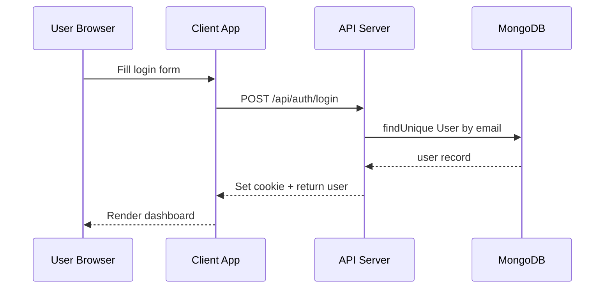

# Estate App

A full-stack real estate application featuring user authentication, property listings, chat functionality, and agent management. The project is divided into three main parts:

1. **API Server** (`/api`) – Express.js server with Prisma (MongoDB), JWT-based auth, RESTful endpoints.
2. **Client** (`/client`) – React application (Vite, Tailwind) for browsing listings, chat, authentication.
3. **Socket Service** (`/socket`) – Node.js service (Socket.IO) for real-time chat messaging.

---

## Architecture Overview

```mermaid
flowchart LR
  subgraph Browser
    C[Client React App]
  end
  subgraph Server
    A[API Server]\n(Express, Prisma, MongoDB)
    S[Socket Service]\n(Socket.IO)
  end
  C -- HTTP/REST --> A
  C -- WebSocket --> S
  A -- Database --> DB[(MongoDB Atlas)]
```

* **Client**: Sends HTTP requests to API endpoints and establishes websocket connections for chat.
* **API Server**: Handles authentication, CRUD operations on `User`, `Post`, `Chat`, `Message`, `Agent`, etc.
* **Socket Service**: Manages real-time message delivery.

---

## Directory Structure

```bash
├── api/               # REST API server
│   ├── controllers/   # Route handlers for auth, posts, chats, messages, users, agent
│   ├── middleware/    # JWT verification middleware
│   ├── prisma/        # Prisma schema & migrations
│   ├── routes/        # Express route definitions
│   └── app.js         # Application entrypoint
├── client/            # React front-end (Vite)
│   ├── src/components # Reusable UI components (Card, Chat, Map, Filter, etc.)
│   ├── src/context    # React Context providers (Auth, Socket, Agent)
│   ├── src/lib        # API request wrapper & helpers
│   ├── src/routes     # Page layouts & views (Home, List, Single, Profile)
│   └── main.jsx       # React application bootstrap
├── socket/            # Socket.IO server for real-time chat
│   └── app.js
├── .env               # Environment variables (CLIENT_URL, DATABASE_URL, JWT_SECRET)
└── README.md          # This file
```

---

## Prerequisites

* Node.js v16+
* npm or yarn
* MongoDB database (e.g., MongoDB Atlas connection URL)

---

## Environment Variables

Create a `.env` file in the `api/` directory with:

```ini
CLIENT_URL=http://localhost:5173
DATABASE_URL=<your-mongodb-connection-string>
JWT_SECRET_KEY=<your-jwt-secret>
```

And in `socket/` if needed:

```ini
# (if socket service also needs DB or other config)
```

---

## Getting Started

### 1. Install Dependencies

```bash
# API server\ ncd api && npm install
# Client\ ncd client && npm install
# Socket service\ ncd socket && npm install
```

### 2. Run Services

```bash
# Start API Server (runs on http://localhost:8800)
cd api && npm run dev

# Start React Client (runs on http://localhost:5173)
cd client && npm run dev

# Start Socket Service (runs on http://localhost:5000)
cd socket && npm run dev
```

---

## API Endpoints

| Route                | Method | Description                         |
| -------------------- | ------ | ----------------------------------- |
| `/api/auth/register` | POST   | User registration                   |
| `/api/auth/login`    | POST   | User login (sets cookie `token`)    |
| `/api/auth/logout`   | POST   | Clear auth cookie                   |
| `/api/posts`         | GET    | List or filter posts                |
| `/api/posts`         | POST   | Create new post (auth required)     |
| `/api/posts/:id`     | GET    | Get single post                     |
| `/api/users`         | GET    | List all users                      |
| `/api/users/:id`     | PUT    | Update user (auth required)         |
| `/api/users/:id`     | DELETE | Delete user (auth required)         |
| `/api/chats`         | GET    | List user chats (auth required)     |
| `/api/chats/:id`     | GET    | Get chat by ID (auth required)      |
| `/api/messages/:id`  | POST   | Add message to chat (auth required) |
| `/api/agent-auth/*`  | POST   | Agent register/login/logout         |
| `/api/agent/*`       | GET    | Agent dashboard & profile (auth)    |

---

## Diagrams & Components

### Sequence Diagram (User Authentication)



### Component Interaction

* **AuthContext**: Provides `currentUser`, `login`, `logout` across React components.
* **SocketContext**: Wraps React app with `Socket.IO` client instance for real-time chat.

---

## Contributing

Feel free to open issues or submit pull requests. Please follow coding standards and include tests for new features.

---

## License

MIT License
