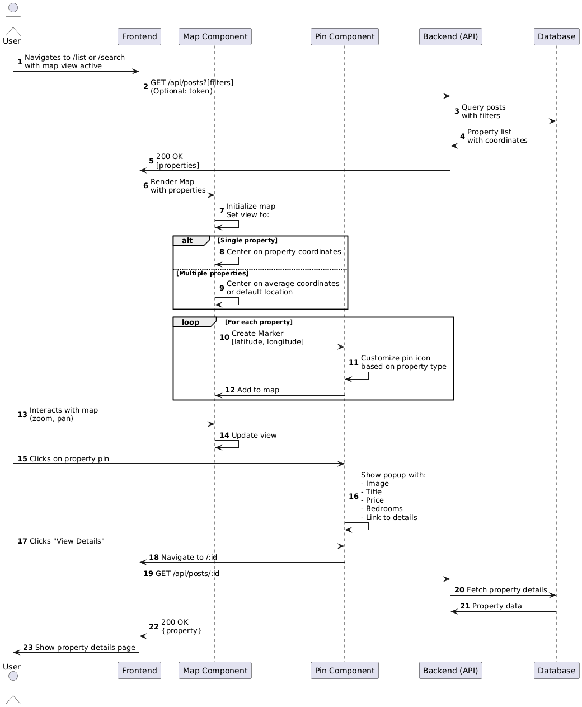

# Real Estate Web Application

A full-stack web application for real estate listings with chat functionality, filtering, agent/admin authentication, and user interaction. Built using:

* **Frontend:** React + Vite + SCSS
* **Backend:** Node.js + Express + Prisma
* **Database:** MongoDB

---

## ✨ Features

### 👤 User Features
- Sign up/login/logout (JWT + cookie-based)
- View property listings
- Save favorite posts
- Chat with agents
- Post property listings
- View price history
- Edit/delete own listings

### 🏆 Agent Features
- Special agent registration/login
- Dedicated dashboard
- Property management tools
- Client communication features

### 👑 Admin Features (via API)
- User and agent data access
- Post management capabilities

## \:file\_folder: Project Structure

```bash
Estate_app/
├── api/             # Express backend
│   ├── controllers/ # Business logic (auth, chat, post, user, agent)
│   ├── middleware/  # JWT verification
│   ├── prisma/      # Prisma schema
│   ├── routes/      # API routes
│   ├── lib/         # Prisma client
│   └── app.js       # Express app
├── client/          # React frontend
│   ├── src/
│   │   ├── components/  # UI components
│   │   ├── context/     # Auth & Socket context
│   │   ├── lib/         # Helper utilities
│   │   ├── routes/      # Pages
│   │   └── main.jsx     # App entry point
├── socket/          # Real-time WebSocket (Socket.IO)
```

---

## \:hammer\_and\_wrench: Getting Started

### 1. Clone the Repository

```bash
git clone https://github.com/tueclonek3/Estate_Elite.git
cd Estate_Elite
```

### 2. Setup Environment Variables

Create `.env` file in `api/`:

```env
DATABASE_URL="your-mongodb-connection-string"
JWT_SECRET_KEY="your-secret-key"
CLIENT_URL="http://localhost:5173"
```

### 3. Install Dependencies

```bash
cd api && npm install
cd ../client && npm install
cd ../socket && npm install
```

### 4. Run the Application

```bash
# Terminal 1: Backend
cd api
npx prisma generate
npx prisma db push
console-ninja node --watch app.js

# Terminal 2: Frontend
cd ../client
npm run dev

# Terminal 3: Socket Server
cd ../socket
console-ninja node --watch app.js
```

---

## \:rocket: API Overview

| Endpoint               | Method | Description          |
| ---------------------- | ------ | -------------------- |
| /api/auth/login        | POST   | User login           |
| /api/auth/register     | POST   | User registration    |
| /api/posts             | GET    | List all posts       |
| /api/users/save        | POST   | Save a post          |
| /api/chats             | GET    | Get user chats       |
| /api/messages/\:chatId | POST   | Send message in chat |

... more routes in `/api/routes/`

---

## Sequence Diagram
### New User Signup Sequence Diagram


This diagram illustrates the registration process for new users. The user submits a registration form through the frontend, which sends data to the backend. The backend validates inputs (email format, password match, required fields) and returns 400 errors for failures. If valid, it generates a username, hashes the password via BCrypt, and attempts to create a user in the database. Conflicts (duplicate email/username) trigger 400 Conflict errors. On success, the backend removes sensitive data (password) and returns a 201 Created response, prompting the frontend to redirect the user to login.
### User Login Sequence Diagram


This diagram illustrates the registration process for new users. The user submits a registration form through the frontend, which sends data to the backend. The backend validates inputs (email format, password match, required fields) and returns 400 errors for failures. If valid, it generates a username, hashes the password via BCrypt, and attempts to create a user in the database. Conflicts (duplicate email/username) trigger 400 Conflict errors. On success, the backend removes sensitive data (password) and returns a 201 Created response, prompting the frontend to redirect the user to login.

### Agent Registration Sequence Diagram

Similar to user signup but tailored for agents. After form submission, the backend validates inputs, hashes passwords, and checks for email/username conflicts in the database. Success creates an agent record, generates a JWT token with an "agent" role, sets an agentToken cookie, and returns agent data. The frontend stores the token and redirects to the agent dashboard.
### Agent Dashboard Access Sequence Diagram

Depicts how authenticated agents access their dashboard. The frontend sends a dashboard request with the agentToken cookie. The backend verifies the token via JWT. If invalid/expired, it returns 401/403 and redirects to login. Valid tokens decode agent details, fetch agent data and related properties (including saved posts/messages) from the database, and return a formatted dashboard response (200 OK).
### Post New Property Sequence Diagram

Shows property creation by users/agents. Users upload images via Cloudinary and submit property details. The frontend verifies authentication (token/agentToken). Authenticated users trigger backend validation, database creation of post and postDetail records, and linkage to the user/agent. Errors return 500; success returns the new property (200 OK) and redirects to its detail page.
### Update Listing Details Sequence Diagram

Describes property editing. Users navigate to an edit form; the frontend fetches existing data. After edits (and optional image updates via Cloudinary), the backend verifies ownership. Price changes trigger priceHistory creation. The backend updates post/postDetail records and returns 200 OK or 500 errors. Success redirects to the updated property page.
### Delete Listings Sequence Diagram

Illustrates property deletion. After user confirmation, the backend checks authentication and ownership. It recursively deletes dependent records (postDetail, priceHistory, savedPosts) before deleting the main post. Success (200 OK) updates the UI; failures return 500 errors.
### Find Properties by Criteria Sequence Diagram

Shows property searches. Users set filters (e.g., price, location); the frontend constructs a query string. The backend optionally authenticates the user, parses filters, and queries the database. Authenticated users receive results with isSaved flags (indicating saved properties). Results display in list/map views.
### View Properties on Map Sequence Diagram

Details map-based property browsing. The frontend fetches properties (with coordinates) from the backend. The map component initializes, centers based on property locations, and renders pins with customized icons. Clicking a pin shows a preview; selecting "View Details" navigates to the property page.
### Contact Property Owners Sequence Diagram

Covers messaging between users and property owners. Authenticated users initiate chats via /api/chats. Existing chats are reused or new ones are created. Messages are saved, and Socket.IO notifies the owner in real-time. Offline owners receive stored notifications.
### Manage Personal Info Sequence Diagram

Describes profile updates (users/agents). Users edit details (e.g., avatar via Cloudinary, password). Password changes trigger re-authentication (log out after update). Other updates return sanitized data (200 OK) and refresh the UI context.
### Save Favorite Properties Sequence Diagram

Shows saving/unsaving properties. Authenticated users click a save icon; the backend checks ownership (users can’t save their own properties). Existing saves are deleted; new ones are added to savedPosts. The frontend toggles the isSaved UI state.

---


